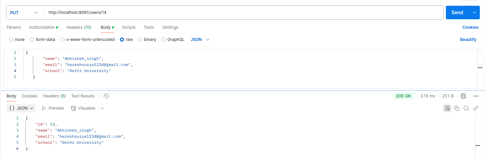
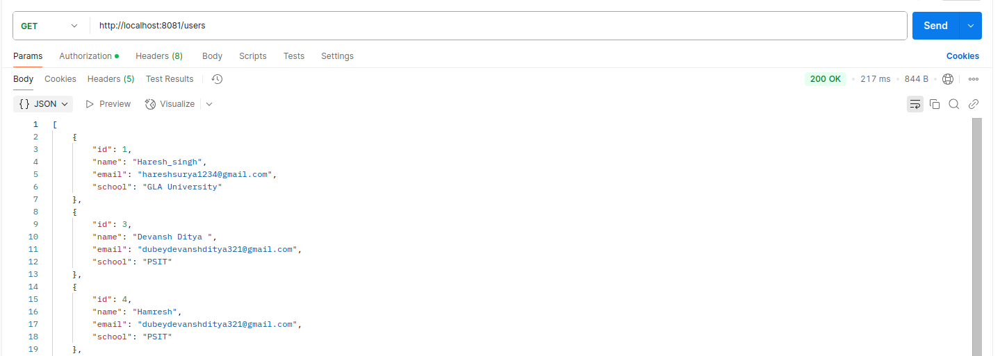

# **IMPLEMENTATION JOURNAL \- Quarkus CRUD API with NGINX Load Balancer**

 

| Submitted By | Haresh Singh |
| :---- | :---- |
| Submitted To | Vipin Tripathi |
| Test Case Version | 1.1 |
| Reviewer  Name | Vipin Tripathi |

**Goal**

The goal of this project is to set up a Quarkus-based CRUD API integrated with MySQL, with multiple API instances running and NGINX acting as a load balancer. The API instances will interact with the MySQL database to handle CRUD operations efficiently, while NGINX distributes the incoming requests among the instances for better performance and reliability.

# 

# **Table of Contents**

1\. PREREQUISITES

1.1 Hardware Requirements	

1.2 Software Requirements

1.3 Network Requirements	

STEPS	

STEP 1: Create the Pod

Command Executed:	

Output Shown:

STEP 2: Setup MySQL Database

Command executed:

Output shown:

Verify it is deployed:

STEP 3: Setting Up the Quarkus Environment

**Downloaded quarkus project using quarkus.io**

Output Shown:

Verify Deployment:

Run the following command:

Access the application at http://localhost:8080

**STEP:04 Created file UserResource.java**

4.1 createDocument

4.2 readDocument	


4.3 updateDocument:


4.4 DeleteDocument:

Output Shown:


**STEP:05 Created User.java file**

**STEP:06 Created application.properties file**

**STEP:07 Created Docker file:**

**STEP:08 Create JAR file**  
Command Executed:

Output Shown:

**STEP:09 Containerization for API**

a) Build image

Output Shown:

b)  Create quarkus instances

Output Shown:

**STEP:10 Setup Nginx Load Balancer**

Command Executed:

Ensure nginx is running:  
Command executed:

Output Shown:

Set Nginx conf file for least connection load balancing

Verify it is deployed:


1. # **PREREQUISITES** 

## **1.1 Hardware Requirements** 

* CPU: Minimum 2 Cores  
* RAM: Minimum 4GB  
* Storage: Minimum 10GB Free Space

## **1.2 Software Requirements**

* Ubuntu (Version: 20.04 or later)  
* Java (Version: 17.0.13)  
* Apache Maven (Version: 3.9.9)  
* MySQL (Version: 8.0)  
* Podman for containerization  
* NGINX(Version: 1.26.3) 

## **1.3 Network Requirements**

* Open ports: 8080 (Quarkus API), 8081 (NGINX Load Balancer)  
* Internal network communication between API instances and database  
* External internet access for downloading dependencies

---

# 

## **STEP 1: Create the Pod** 

Before running containers, create a pod to ensure all services share the same network and communicate properly.

### **Command Executed:** 

```
podman pod create --name quarkus-pod -p 8080:8080 -p 8081:80 -p 8082:8082 -p 8083:8083 -p 3306:3306
```
### **Output Shown:** 

```
f58a14129220  localhost/podman-pause:4.9.3-0                         	5 days ago  Up 26 minutes  0.0.0.0:3306->3306/tcp, 0.0.0.0:8080->8080/tcp, 0.0.0.0:8081->80/tcp, 0.0.0.0:8082-8083->8082-8083/tcp  1323057010ca-infra
```
## **STEP 2: Create MySQL Database Container** 

```
podman run -d \
--name mysql \
--pod quarkus-pod \
-e MYSQL_ROOT_PASSWORD=Haresh@123 \
-e MYSQL_DATABASE=quarkusdb \
-e MYSQL_USER=Haresh \
-e MYSQL_PASSWORD=Haresh@123 \
-v ~/mysql-data:/var/lib/mysql:Z \
mysql:latest

```
### **Output shown:** 
podman ps

```
a55c10f7095a  docker.io/library/mysql:latest   	mysqld            	5 days ago  Up 33 minutes  0.0.0.0:3306->3306/tcp, 0.0.0.0:8080->8080/tcp, 0.0.0.0:8081->80/tcp, 0.0.0.0:8082-8083->8082-8083/tcp  mysql
```
#### **Verify it is deployed:**

```
haresh-singh@haresh-singh-C340:~$ podman exec -it mysql bash
bash-5.1# mysql -u Haresh -p
Enter password:
Welcome to the MySQL monitor.  Commands end with ; or \g.
Your MySQL connection id is 14
Server version: 9.1.0 MySQL Community Server - GPL

Copyright (c) 2000, 2024, Oracle and/or its affiliates.

Oracle is a registered trademark of Oracle Corporation and/or its
affiliates. Other names may be trademarks of their respective
owners.

Type 'help;' or '\h' for help. Type '\c' to clear the current input statement.

mysql> use quarkusdb;
Reading table information for completion of table and column names
You can turn off this feature to get a quicker startup with -A

Database changed
mysql> show databases;
+--------------------+
| Database       	|
+--------------------+
| information_schema |
| performance_schema |
| quarkusdb      	|
+--------------------+
3 rows in set (0.01 sec)

mysql>
```

## **STEP 3: Setting Up the Quarkus Environment** 

### **Downloaded quarkus project using quarkus.io** 

 

 **These dependencies are use:** 

```
RESTEasy Classic Jackson
JDBC Driver - MySQL 
Hibernate ORM 
RESTEasy Classic 
```

##### 

### 

### **Output Shown:** 

```
haresh-singh@haresh-singh-C340:~/quarkus-crud$ ls -lrt
total 56
-rw-rw-r--  1 haresh-singh haresh-singh  2299 Jan 10 12:55 README.md
-rw-rw-r--  1 haresh-singh haresh-singh  7591 Jan 10 12:55 mvnw.cmd
-rwxrwxr-x  1 haresh-singh haresh-singh 11289 Jan 10 12:55 mvnw
drwxrwxr-x  4 haresh-singh haresh-singh  4096 Jan 10 12:55 src
-rw-rw-r--  1 haresh-singh haresh-singh  4724 Jan 10 13:03 pom.xml
-rw-rw-r--  1 haresh-singh haresh-singh   383 Jan 23 12:01 Dockerfile
drwxrwxr-x  2 haresh-singh haresh-singh  4096 Jan 27 12:26 quarkus-data
drwxrwxr-x  2 haresh-singh haresh-singh  4096 Jan 27 17:20 secondinstance
drwxrwxr-x  2 haresh-singh haresh-singh  4096 Jan 27 17:22 thirdinstance
drwxrwxr-x 10 haresh-singh haresh-singh  4096 Feb 10 11:15 target
```
### **Verify Deployment:** 

### **Run the following command:**

```
mvn quarkus:dev
```
### **Access the application at [http://localhost:8080](http://localhost:8080)** {#access-the-application-at-http://localhost:8080}

## 

## **STEP:04 Created file UserResource.java**

Created file UserResource.java for handling Restful API and it provides CRUD operations.

**Implementing CRUD Operations:**  
**Implement the following methods in UserResource.java:**

#### **4.1 createDocument** 

```	

@POST
	@Transactional
	public Response createUser(User user) {
    	if (user == null) {
        	return Response.status(Response.Status.BAD_REQUEST).entity("User data is required").build();
    	}
    	userRepository.persist(user);
    	return Response.status(Response.Status.CREATED).entity(user).build();
```
**Output Shown:**  


####  **4.2 readDocument** 

```
@GET
   public Response getAllUsers() {
       List<User> users = userRepository.listAll();
       if (users.isEmpty()) {
           return Response.status(Response.Status.NO_CONTENT).entity("No users found").build();
       }
       return Response.ok(users).build();
   }

   @GET
   @Path("/{id}")
   public Response getUserById(@PathParam("id") Long id) {
       User user = userRepository.findById(id);
       if (user == null) {
           return Response.status(Response.Status.NOT_FOUND).entity("User not found").build();
       }
       return Response.ok(user).build();
   }
```
**Output Shown:**  


#### **4.3 updateDocument:**

```
@PUT
	@Path("/{id}")
	@Transactional
	public Response updateUser(@PathParam("id") Long id, User user) {
    	User existingUser = userRepository.findById(id);
    	if (existingUser == null) {
        	return Response.status(Response.Status.NOT_FOUND).entity("User not found").build();
    	}

    	if (user.getName() != null) {
        	existingUser.setName(user.getName());
    	}
    	if (user.getEmail() != null) {
        	existingUser.setEmail(user.getEmail());
    	}
    	if (user.getSchool() != null) {
        	existingUser.setSchool(user.getSchool());
    	}

    	return Response.ok(existingUser).build();
	}
```
**Output Shown:**  
 
	

#### **4.4 DeleteDocument:** 

```
@DELETE
	@Path("/{id}")
	@Transactional
	public Response deleteUser(@PathParam("id") Long id) {
    	boolean deleted = userRepository.deleteById(id);
    	if (!deleted) {
        	return Response.status(Response.Status.NOT_FOUND).entity("User not found").build();
    	}
    	return Response.noContent().build();
	}
}


	@Path("/{id}")
	public Response getUserById(@PathParam("id") Long id) {
    	User user = userRepository.findById(id);
    	if (user == null) {
        	return Response.status(Response.Status.NOT_FOUND).entity("User not found").build();
    	}
return Response.ok(user).build();
``` 	

**Output Shown:** 


## **STEP:05 Created User.java file** 

The class fields name, email, and school store user-related information and are mapped to corresponding columns in the User table as attributes of a User entity using JPA with Hibernate.
```
public class User {
   @Id
   @GeneratedValue(strategy = GenerationType.IDENTITY)
   private Long id;

   private String name;
   private String email;
   private String school;
```
## 

## **STEP:06 Created application.properties file**

The properties added configure the MySQL database connection, enable Hibernate ORM with automatic schema updates and SQL logging, optimize database connection pooling, and set up the HTTP server to bind on all interfaces and run on port 8080\.

```
# Database configuration for MySQL
quarkus.datasource.db-kind=mysql
quarkus.datasource.username=Haresh
quarkus.datasource.password=Haresh@123
# quarkus.datasource.jdbc.url=jdbc:mysql://localhost:3306/quarkusdb
quarkus.datasource.jdbc.url=jdbc:mysql://mysql:3306/quarkusdb
quarkus.hibernate-orm.database.generation=update
quarkus.hibernate-orm.log.sql=true

# Connection pool settings
quarkus.datasource.jdbc.min-size=5
quarkus.datasource.jdbc.max-size=20
quarkus.datasource.jdbc.idle-removal-interval=PT1M
quarkus.datasource.jdbc.acquisition-timeout=30

# HTTP server configuration
quarkus.http.host=0.0.0.0
quarkus.http.port=8080

```

## 

## **STEP:07 Created Docker file:** 

```
FROM openjdk:17-jdk

# Set the language and locale environment variables
ENV LANGUAGE='en_US:en'

# Define layers to optimize cache usage during build:
# This ensures that if only application code changes, the dependencies will be cached and reused.

# Copy dependencies first to make use of Docker cache efficiently
COPY --chown=185 target/quarkus-app/lib/ /deployments/lib/

# Copy other parts of the application
COPY --chown=185 target/quarkus-app/*.jar /deployments/
COPY --chown=185 target/quarkus-app/app/ /deployments/app/
COPY --chown=185 target/quarkus-app/quarkus/ /deployments/quarkus/

# Expose the port for the Quarkus application
EXPOSE 8080

# Switch to the user with ID 185 (ensure that this user exists in the image or use another user if needed)
USER 185

# Set Java options for Quarkus to listen on all interfaces and use a specific logging manager
ENV JAVA_OPTS="-Dquarkus.http.host=0.0.0.0 -Djava.util.logging.manager=org.jboss.logmanager.LogManager"

# Define the path to the Quarkus JAR file
ENV JAVA_APP_JAR="/deployments/quarkus-run.jar"

# Use the java command directly to run the application
ENTRYPOINT ["java", "-jar", "/deployments/quarkus-run.jar"]
```
## 

## **STEP:08 Create JAR file**  **Command Executed:** 

```
mvn clean package

```

### **Output Shown:** 

```
mvn clean package
[INFO] Scanning for projects...
[INFO]
[INFO] ----------------------< com.example:quarkus-crud >----------------------
[INFO] Building quarkus-crud 1.0.0-SNAPSHOT
[INFO]   from pom.xml
[INFO] --------------------------------[ jar ]---------------------------------
[INFO]
[INFO] --- clean:3.2.0:clean (default-clean) @ quarkus-crud ---
[INFO] Deleting /home/haresh-singh/quarkus-crud/target
[INFO]
[INFO] --- resources:3.3.1:resources (default-resources) @ quarkus-crud ---
[INFO] Copying 3 resources from src/main/resources to target/classes
[INFO]
[INFO] --- quarkus:3.17.6:generate-code (default) @ quarkus-crud ---
[INFO]
[INFO] --- compiler:3.13.0:compile (default-compile) @ quarkus-crud ---
[INFO] Recompiling the module because of changed source code.
[INFO] Compiling 4 source files with javac [debug release 17] to target/classes
[INFO]
[INFO] --- quarkus:3.17.6:generate-code-tests (default) @ quarkus-crud ---
[INFO]
[INFO] --- resources:3.3.1:testResources (default-testResources) @ quarkus-crud ---
[INFO] skip non existing resourceDirectory /home/haresh-singh/quarkus-crud/src/test/resources
[INFO]
[INFO] --- compiler:3.13.0:testCompile (default-testCompile) @ quarkus-crud ---
[INFO] Recompiling the module because of changed dependency.
[INFO] Compiling 2 source files with javac [debug release 17] to target/test-classes
[INFO]
[INFO] --- surefire:3.5.0:test (default-test) @ quarkus-crud ---
[INFO]
[INFO] --- jar:3.4.1:jar (default-jar) @ quarkus-crud ---
[INFO] Building jar: /home/haresh-singh/quarkus-crud/target/quarkus-crud-1.0.0-SNAPSHOT.jar
[INFO]
[INFO] --- quarkus:3.17.6:build (default) @ quarkus-crud ---
[INFO] [io.quarkus.deployment.QuarkusAugmentor] Quarkus augmentation
completed in 3264ms
[INFO] ------------------------------------------------------------------------
[INFO] BUILD SUCCESS
[INFO] --------------------------------------------------------
----------------
[INFO] Total time:  12.567 s
[INFO] Finished at: 2025-02-11T17:00:50+05:30
```

## **STEP:09 Containerization for API** 

1) ### **Build image**

**Command executed:** 
```
podman build -t quarkus-crud-image -f  src/main/docker/Dockerfile.jvm
```    

###        **Output Shown:**

```
haresh-singh@haresh-singh-C340:~$ podman images
REPOSITORY                	TAG     	IMAGE ID  	CREATED   	SIZE
localhost/podman-pause    	4.9.3-0 	7265a2e26beb  7 days ago	835 kB
localhost/quarkus-crud-image  latest  	4d4742db7166  9 days ago	519 MB
docker.io/library/nginx   	latest  	9bea9f2796e2  2 months ago  196 MB
docker.io/library/mysql   	latest  	56a8c14e1404  3 months ago  621 MB
docker.io/library/openjdk 	17-jdk  	5e28ba2b4cdb  2 years ago   475 MB
```
### **b)  Create quarkus instances**

First instance

```
podman run -d --pod quarkus-pod --name quarkus-crud-jvm -e QUARKUS_HTTP_PORT=8080 -e QUARKUS_DATASOURCE_URL=jdbc:mysql://mysql:3306/quarkusdb -e QUARKUS_DATASOURCE_USERNAME=Haresh -e QUARKUS_DATASOURCE_PASSWORD=Haresh@123 quarkus-crud-image

Second instance

podman run -d --pod quarkus-pod --name quarkus-crud-jvm1 -e QUARKUS_HTTP_PORT=8082 -e QUARKUS_DATASOURCE_URL=jdbc:mysql://mysql:3306/quarkusdb -e QUARKUS_DATASOURCE_USERNAME=Haresh -e QUARKUS_DATASOURCE_PASSWORD=Haresh@123 quarkus-crud-image

 Third instance
 podman run -d --pod quarkus-pod --name quarkus-crud-jvm2 -e QUARKUS_HTTP_PORT=8083 -e QUARKUS_DATASOURCE_URL=jdbc:mysql://mysql:3306/quarkusdb -e QUARKUS_DATASOURCE_USERNAME=Haresh -e QUARKUS_DATASOURCE_PASSWORD=Haresh@123 quarkus-crud-image

```
### **Output Shown:** 

```
CONTAINER ID  IMAGE                            	COMMAND 	CREATED 	STATUS     	PORTS                                                                                               	NAMES
f58a14129220  localhost/podman-pause:4.9.3-0               	7 days ago  Up 27 seconds  0.0.0.0:3306->3306/tcp, 0.0.0.0:8080->8080/tcp, 0.0.0.0:8081->80/tcp, 0.0.0.0:8082-8083->8082-8083/tcp  1323057010ca-infra
78cd08da7eed  localhost/quarkus-crud-image:latest          	7 days ago  Up 3 seconds   0.0.0.0:3306->3306/tcp, 0.0.0.0:8080->8080/tcp, 0.0.0.0:8081->80/tcp, 0.0.0.0:8082-8083->8082-8083/tcp  quarkus-crud-jvm1
4e12651227ca  localhost/quarkus-crud-image:latest          	7 days ago  Up 3 seconds   0.0.0.0:3306->3306/tcp, 0.0.0.0:8080->8080/tcp, 0.0.0.0:8081->80/tcp, 0.0.0.0:8082-8083->8082-8083/tcp  quarkus-crud-jvm2
```

##         **STEP:10 Create Nginx Load Balancer Container**

### **Command Executed:**

```
podman run -d --pod quarkus-pod --name nginx-container -v /home/haresh-singh/nginx/conf:/etc/nginx:rw nginx
```
### **Ensure nginx is running:** **Command executed:**

```
podman ps
```

### **Output Shown:** 

```
f18a33923184  docker.io/library/nginx:latest   	nginx -g daemon o...  5 days ago  Up 22 minutes  0.0.0.0:3306->3306/tcp, 0.0.0.0:8080->8080/tcp, 0.0.0.0:8081->80/tcp, 0.0.0.0:8082-8083->8082-8083/tcp  nginx-container
```


### **Set Nginx conf file for least connection load balancing**  

```
events {}

http {
	log_format upstreamlog '$remote_addr - [$time_local] '
                      	'"$request" $status '
                      	'to: $upstream_addr '
                      	'in: $request_time '
                      	'upstream_response_time: $upstream_response_time';

	access_log /var/log/nginx/access.log upstreamlog;

	upstream quarkus_backend {
    	least_conn;
    	server quarkus-crud-jvm:8080;
    	server quarkus-crud-jvm1:8082;
    	server quarkus-crud-jvm2:8083;
	}

	server {
    	listen 80;

    	location / {
        	proxy_pass http://quarkus_backend;
        	proxy_set_header Host $host;
        	proxy_set_header X-Real-IP $remote_addr;
        	proxy_set_header X-Forwarded-For $proxy_add_x_forwarded_for;
        	proxy_set_header X-Forwarded-Proto $scheme;
    	}
	}
}
```

###  **Verify it is deployed:**

```
podman exec nginx-container nginx -t
nginx: the configuration file /etc/nginx/nginx.conf syntax is ok
nginx: configuration file /etc/nginx/nginx.conf test is successful
```


