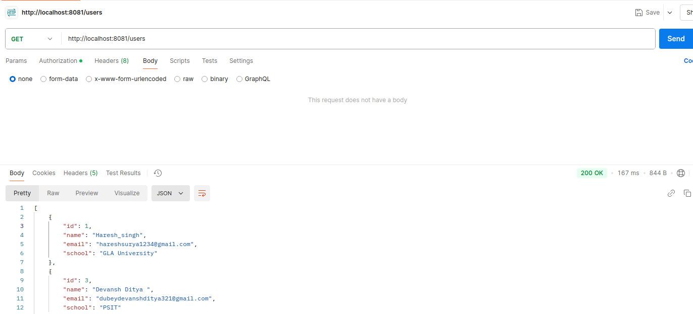
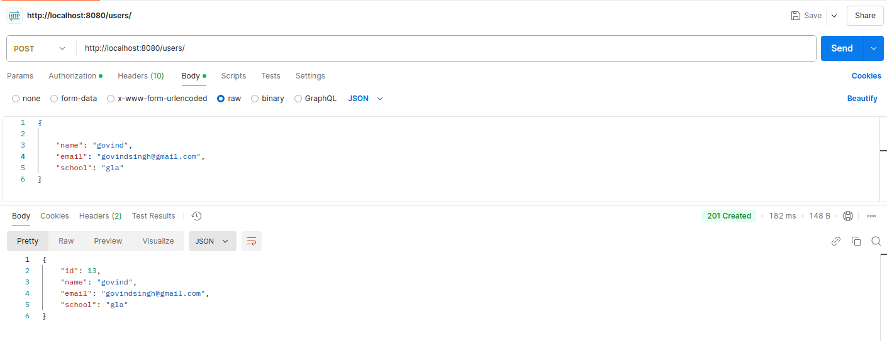
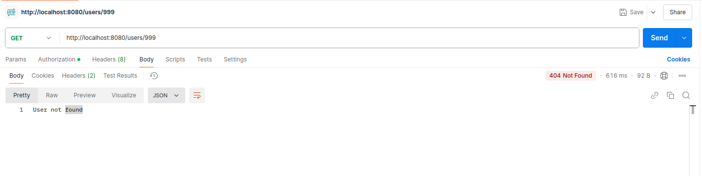
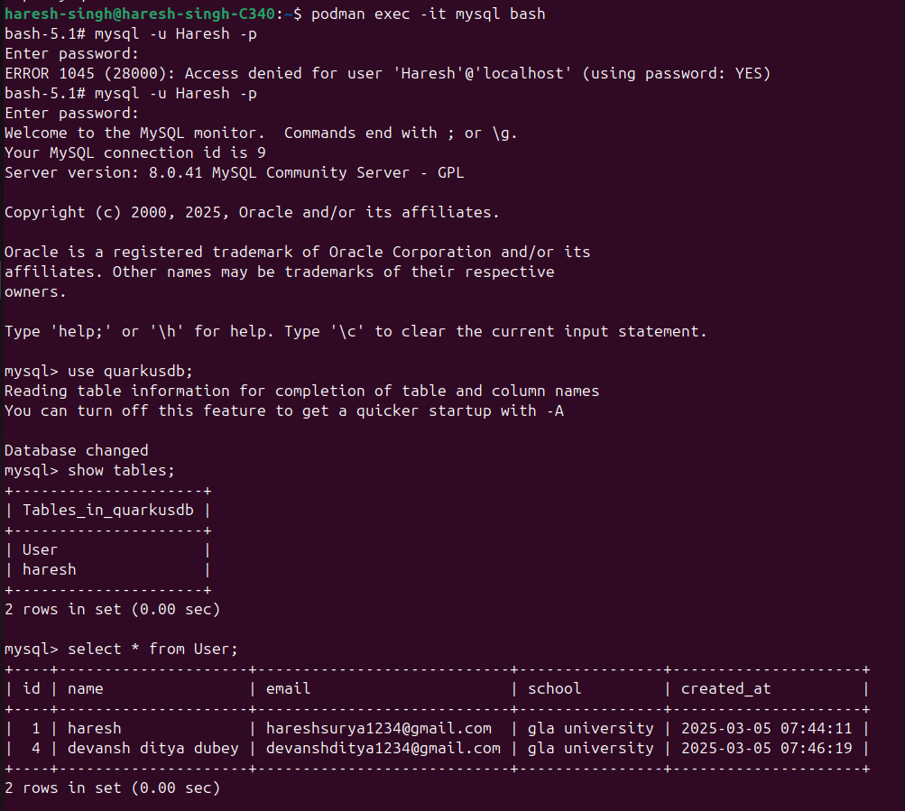
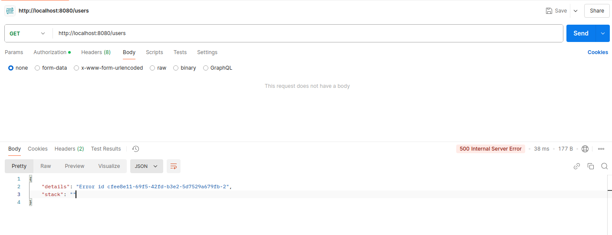
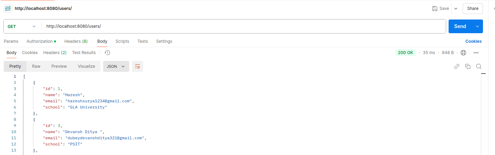

# **TEST CASES: CRUD API Using Quarkus**

| Submitted By | Haresh Singh |
| :---- | :---- |
| Submitted To | Mr.Vipin Tripathi |
| Test Case Version | 1 |
| Reviewer  Name | Ms. Moumita Roy |

**Goal**

The goal of this project is to set up a Quarkus-based CRUD API integrated with MySQL, with multiple API instances running and NGINX acting as a load balancer. The API instances will interact with the MySQL database to handle CRUD operations efficiently, while NGINX distributes the incoming requests among the instances for better performance and reliability.

**Table of Content:**

**Test Case 1 Valid Request GET to Fetch All Records**

**Test Case 2 Valid Request POST to Add a New Record**

**Test Case 3 Valid Request PUT to Update a Record**

**Test Case 4 Valid Request DELETE to Remove a Record**

**Test Case 5 Invalid Request GET for a Non-Existing Record**

**Test Case 6 Valid MySQL Container Connectivity**

**Test Case 7 MySQL Container Failure Handling**

**Test Case 8 Load Balancer NGINX Distributes Traffic**

**Test Case 9 Load Balancer Handles Instance Failure**
### 

**Test Case 1: Valid Request GET to Fetch All Records**

|  Scenario |  | Scenario: Fetch all data from the mysql database without specifying any query parameters. |  |  |  |
| :---- | ----- | :---- | :---- | :---- | :---- |
| **Remarks** |  | Verify that all records are returned for a GET request to fetch all items. |  |  |  |
| **Given** |  | The Quarkus server is running on port 8080\. **And** The Mysql database is accessible. **And**The table `User` in the `quarkusdb` database exists and contains data. **And**Already install postman |  |  |  |
| **When** |  | The user makes a GET request to [http://localhost:8080/users/](http://localhost:8080/users/) using postman  |  |  |  |
|  **Then**  |  | The response contains JSON data with details about all users  **And** The server responds with a 200 status code. Checked |  |  |  |
| **Test Run** |  | **Date** |  | **Result** |  |

### 

### 

### **Test Case 2: Valid Request POST to Add a New Record** {#test-case-2:-valid-request-post-to-add-a-new-record}

| Scenario |  | Add a new record to the MySQL database. |  |  |  |
| :---- | ----- | :---- | :---- | :---- | :---- |
| **Remarks**  |  | Verify that a new record is successfully added when a valid POST request is made. |  |  |  |
| **Given** |  | The Quarkus server is running on port 8080\. **And** The mysql database is accessible. **And**Already install postman |  |  |  |
| **When** |  | The user makes a POST request to [`http//localhost8080/users`](http://localhost:8080/users) with a valid JSON payload using postman |  |  |  |
| **Then** |  | A new record is created in the `User` table with the specified details-name,email,school.what specified details **And** The server responds with a 200 status code. **And** The response contains the created item's details with an auto-generated `id`. |  |  |  |
| **Test Run** |  | **Date** |  | **Result** |  |

### **Test Case 3: Valid Request PUT to Update a Record** 

| Scenario |  | Update an existing record in the database. |  |  |  |
| :---- | ----- | :---- | :---- | :---- | :---- |
| **Remarks** |  | Verify that an existing record is successfully updated when a valid PUT request is made. |  |  |  |
| **Given** |  | The Quarkus server is running on port 8080\. **And** The mysql database is accessible. **And** The `User` table contains a record with `id` **And**Already install postman |  |  |  |
| **When** |  | The user makes a PUT request to: [`http://localhost:8080/users/`](http://localhost:8080/users/id)`1` with a valid JSON payload: using postman |  |  |  |
| **Then** |  | The record with `id=1` is updated in the database with the new values. **And** The response contains the updated user's details. Checked |  |  |  |
| **Test Run** |  | **Date** |  | **Result** |  |

### **Test Case 4: Valid Request DELETE to Remove a Record** 

|  Scenario |  | Delete an existing record from the database. |  |  |  |
| :---- | ----- | :---- | :---- | :---- | :---- |
| **Remarks** |  | Verify that an existing record is successfully deleted when a valid DELETE request is made. |  |  |  |
| **Given** |  | The Quarkus server is running on port 8080\. **And** The `User` table contains a record with `id=1`. **And**Already install postman |  |  |  |
| **When** |  | The user makes a DELETE request to [`http://localhost:8080/users/1`](http://localhost:8080/users/1) Using postman |  |  |  |
| **Then** |  | The record with `id=1` is deleted from the database. **And** The server responds with a 204 status code. **And**No content is returned in the response body. checked  |  |  |  |
| **Test Run** |  | **Date** |  | **Result** |  |

### **Test Case 5: Invalid Request GET for a Non-Existing Record**

| Scenario |  | Fetch details of a non-existing record from the database. |  |  |  |
| :---- | ----- | :---- | :---- | :---- | :---- |
| **Remarks** |  | Verify that the correct error response is returned when a GET request is made for a non-existing record. |  |  |  |
| **Given** |  | The Quarkus server is running on port 8080\. **And** The mysql database is accessible. **And** The `User` table does not contain a record with `id=999`. |  |  |  |
| **When** |  | The user makes a GET request to [`http://localhost:8080/users/999`](http://localhost:8080/users/999) **And** The user clicks on the send button or enters. |  |  |  |
|  **Then** |  | The server responds with a 404 status code. **And**The response contains an error message. “User not found” checked |  |  |  |
| **Test Run** |  | **Date** |  | **Result** |  |

### **Test Case 6: Valid MySQL Container Connectivity** 

| Scenario |  | Verify that the API can successfully connect to the MySQL container. |  |  |  |
| :---- | ----- | :---- | :---- | :---- | :---- |
| **Remarks** |  | Ensure the API can communicate with the MySQL container. |  |  |  |
| **Given** |  | The MySQL container is running on `localhost:3306` with Username: `Haresh` Password: `Haresh@123` Database: `quarkusdb` **And** The Quarkus server is running on port 8080 with correct database credentials in `application.properties`. |  |  |  |
| **When** |  | The API starts and initializes the database connection. |  |  |  |
| **Then** |  | CRUD operations performed via the API successfully modify the `quarkusdb` database. Checked |  |  |  |
| **Test Run** |  | **Date** |  | **Result** |  |

### 

### **Test Case 7: MySQL Container Failure Handling**

| Scenario |  | Verify the behavior of the API when the MySQL container is unavailable.  |  |  |  |
| :---- | ----- | :---- | :---- | :---- | :---- |
| **Remarks** |  | Verify the behavior of the API when the MySQL container is unavailable. |  |  |  |
|  **Given** |  | The Quarkus server is running on port 8080\. **And** The MySQL container is stopped or unavailable. |  |  |  |
| **When** |  | The user makes a GET request to: [`http://localhost:8080/users`](http://localhost:8080/users) |  |  |  |
| **Then** |  | The server responds with a 500 status code. **And** The response contains an error message Checked |  |  |  |
| **Test Run** |  | **Date** |  | **Result** |  |

### **Test Case 8: Load Balancer NGINX Distributes Traffic** 

| Scenario |  | Verify that the NGINX load balancer distributes traffic across all API instances.  |  |  |  |
| :---- | ----- | :---- | :---- | :---- | :---- |
| **Remarks** |  | Ensure that traffic is distributed evenly among the API containers. |  |  |  |
| **Given** |  | NGINX container is running on port 8081\. **And** API instance 1 is running on port 8080\. **And** API instance 2 is running on port 8082\. **And** API instance 3 is running on port 8083\. |  |  |  |
| **When** |  | The user sends multiple GET requests to [`http://localhost:8081/users`](http://localhost:8081/users) |  |  |  |
| **Then** |  | NGINX forwards the requests to the API instances in a round-robin manner Request \-\> API instance 1 (`localhost:8080`) Request \-\> API instance 2 (`localhost:8082`) Request \-\> API instance 3 (`localhost:8083`). Checked |  |  |  |
| **Test Run** |  | **Date** |  | **Result** |  |

### 

### **Test Case 9: Load Balancer Handles Instance Failure**

| Scenario |  | Verify that the NGINX load balancer handles failures when one or more API instances are unavailable.  |  |  |  |
| :---- | ----- | :---- | :---- | :---- | :---- |
| **Remarks** |  | Ensure NGINX continues to route traffic to available API instances.. |  |  |  |
| **Given** |  | NGINX container is running on port 8081\. **And** API instance 1 is running on port 8080\. **And** API instance 2 is running on port 8082 **And** API instance 3 is stopped or unavailable. |  |  |  |
| **When** |  | The user sends multiple GET requests to [`http://localhost:8081/users`](http://localhost:8081/users) |  |  |  |
| **Then** |  | NGINX forwards the requests only to the available API instances: Request 1 \-\> API instance 1 (`localhost:8080`) Request 2 \-\> API instance 2 (`localhost:8082`) **And** Each available API instance responds with a 200 status code and valid JSON data. **And** NGINX does not forward requests to the unavailable instance, and no errors are observed. Checked |  |  |  |
| **Test Run** |  | **Date** |  | **Result** |  |

